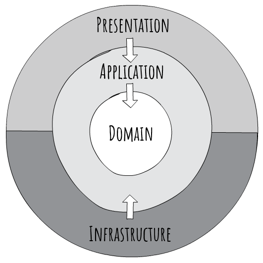
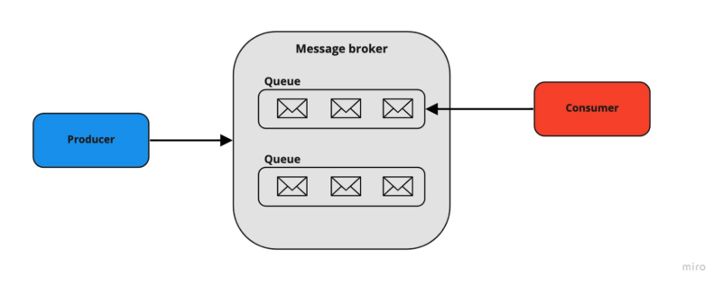
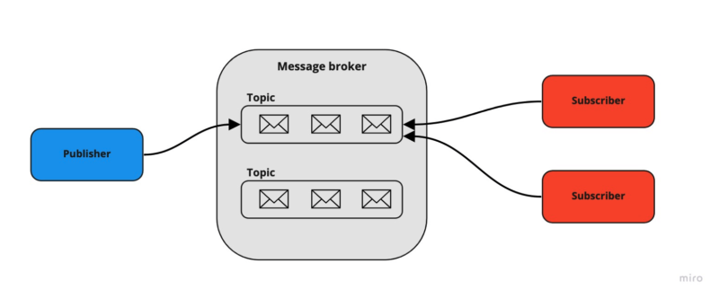

# CleanArchitecture-Sample1
 Learn clean architecture by practicing


## Getting Started

Launch the app:
```bash
cd src/API
dotnet run
```


## Database

To add a new migration from the root folder:

```bash
dotnet ef migrations add MigrationName --project src\Infrastructure --startup-project src\API --output-dir Database\Migrations
```

To update database from the root folder:
```bash
dotnet ef database update --project src\Infrastructure --startup-project src\API
```

## Unit Test

To run all test cases:

```bash
dotnet test --collect:"XPlat Code Coverage"
```

To generate test report:

```bash
reportgenerator -reports:"TestResults\**\coverage.cobertura.xml" -targetdir:"coveragereport" -reporttypes:Html
```


# Technical references
## 1. Clean architecture
In Clean Architecture, the Domain and Application layers are at the center of this concept, this is also known as Core component. 
    - The Domain layer contains enterprise logic and types.
    - The Application layer contains business logic and types.
    
Core should not depend on data access or other infrastructure concerns, all of those are inverted (by using interfaces and/or abstractions within Core and implemented by layers outside of Core)



Some benefits with Clean Architecture:
1. Maintainability
Clean Architecture typically has 4 layers: Domain, Application, Infrastructure, Presentation. Each layer has a certain responsibility, this makes maintaining and modifying easier as you only focus on one aspect at a time.

2. Dependency Inversion
With Clean Architecture, all dependencies should point inward. The Core layers depend on abstractions, the outer layers implement these abstractions. Dependency inversion allows you to be independent of frameworks or external concerns in the Core layers.

3. Testability
By using dependency inversion, all your business logic can be test easily. You can quickly write unit tests by mocking those interfaces/abstractions.

4. Scalability and Flexibility
Clean Architecture is modular, which mean allow you to swap out technologies for more scalable solutions.

5. Separation of Concerns 
By decoupling different aspects of the application, you can focus on implementing on a specific parts.

References: https://jasontaylor.dev/clean-architecture-getting-started/


## 2. CQRS pattern
CQRS stands for Command and Query Responsibility Segregation, a pattern that separates read and update operations for a data store.

References: https://learn.microsoft.com/en-us/azure/architecture/patterns/cqrs


## 3. Unit of work & generic repository
### 3.1 Unit of work
The Unit of Work (UoW) groups one or more database operations into a single transaction and executes them by applying the principle of do everything or do nothing. If any of the transaction's operations fail, it will rollback the transaction, otherwise it will commit the transaction. The key idea of this pattern is implement a layer that centralizing store for all the repositories to receive the instance of the DbContext. This will ensure that for a transaction, it should either be complete for all entities or should fail entirely (since all of them using the same instance of the DbContext).

### 3.2 Generic repository
The Generic Repository can be used for all entities, which mean all the standard operations (such as: query, get by id, add, delete,...) will be put inside the Generic Repository for reuse code purposes.


## 4. Message broker
Message broker is an important piece of microservices, which enables services and applications can communicate with each other using messages. 

These are some basic concept of a message broker:
- **Producer**: The service/application responsible for sending messages. In publish/subscribe pattern they are called publishers.
- **Consumer**: The endpoint that consumes messages waiting in the message broker. In publish/subscribe pattern they are called subscribers.
- **Queue/topic**: a folder in filesystem, where message broker uses them to store messages.

There are two common distribution patterns:

**Point-to-point messaging:**
In this pattern, only one-to-one relation set between the sender and the receiver of the message. (Queue message broker)



**Publish/subscribe:**
This pattern is slightly different from the previous one. For this publish/subscribe pattern, the sender of the message does not know anything about the receivers. It's mean that the message is being sent to the topic, it will distribute to all subcribers's endpoints of the topic.



**Advantages of message broker:**
1. Provided communication between services that may not be running at the same time: The producer can send messages regardless of whether the consumer is active or not. All it needs is a running message broker. The same applies to the consumer.
2. Improved system performance by introducing asynchronous processing: High-consuming tasks can be distributed to separate processes. That will fasten up your application and increase user experience.
3. Increased reliability by guaranteeing the transmission of messages: Message brokers offer a redelivering mechanism. In case of consumer failure, it can redeliver the message immediately or after some specified time. It also supports routing of not delivered messages – it’s called a dead-letter mechanism.

**Disadvantages of message broker:**
1. Increased system complexity
2. Debugging can be harder

References: https://tsh.io/blog/message-broker/